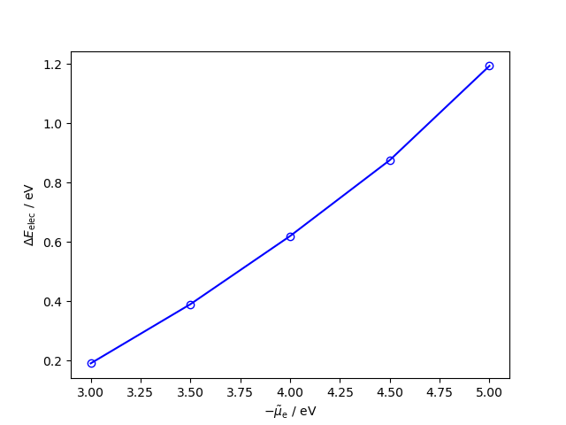
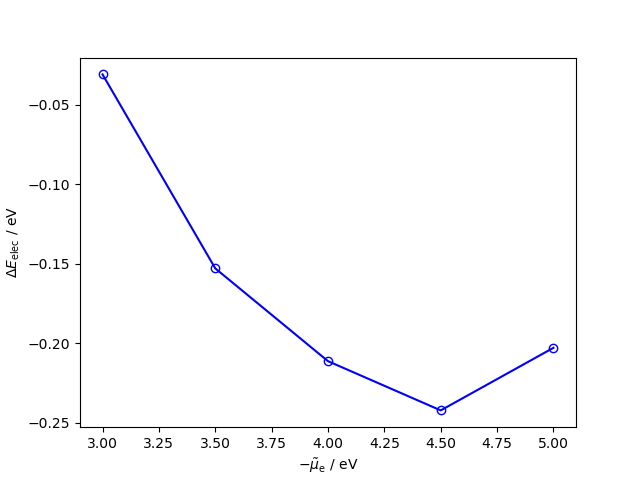

A previous geometry of CO2 on a silver step was used to define an initial geometry for CO2 adsorbed on a gold(211) step. The geometry was then optimized without the solvated jellium (so roughly at PZC). Then the energy of the slab with CO2, as well as the empty slab, was calculated with the SJM model for a range of potentials. Note that 0 v. SHE is roughly at 4.4 V. The electronic part of the binding energy was calculated in reference to gaseous CO2. No zero-point energy or thermodynamic corrections have been done here yet.

The same thing can be done for CO:

Interestingly the binding energy for CO is lower than that of CO2, whereas the opposite results have been reported experimentally. Perhaps adding a water layer would improve the results.
